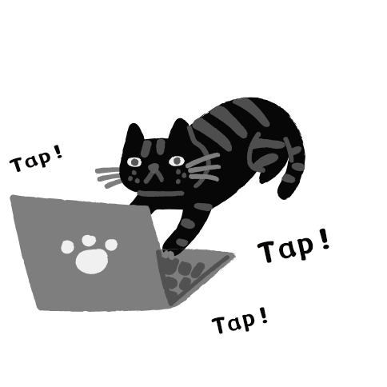

<p align="center">
    
</p>

<h3 align="center">Next.js Github Expolorer</h3>

<p align="center">
  <a href="https://yilingtung.github.io/github-explorer/">Github Explorer</a> Next.js version 
  <br><br>
  <a href="https://nextjs-github-explorer.vercel.app/"><strong>Visit the App »</strong></a>
  <br>
</p>

## Intro

This project was bootstrapped with [Next.js](https://nextjs.org/).<br>
Similar to [Github Explorer](https://yilingtung.github.io/github-explorer/) but with more implementation of server side rendering.

## Demo

You counld also try the real app here. 👉🏻 [https://nextjs-github-explorer.vercel.app/](https://nextjs-github-explorer.vercel.app/)
<br>

## Getting Started

First, run the development server:

```bash
npm run dev
# or
yarn dev
```

Open [http://localhost:3000](http://localhost:3000) with your browser to see the result.

## Build With

- [Next.js](https://nextjs.org/)
- [TypeScript](https://www.typescriptlang.org/)
- [styled-components](https://styled-components.com/)
- [react-window](https://github.com/bvaughn/react-window)
- [react-query](https://react-query.tanstack.com/)

## Code Quality & Testing

- [ESLint](https://eslint.org/)
- [Prettier](https://prettier.io/)
- [Husky](https://github.com/typicode/husky)
